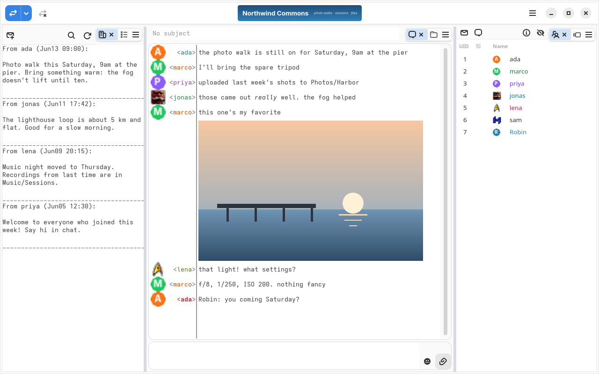
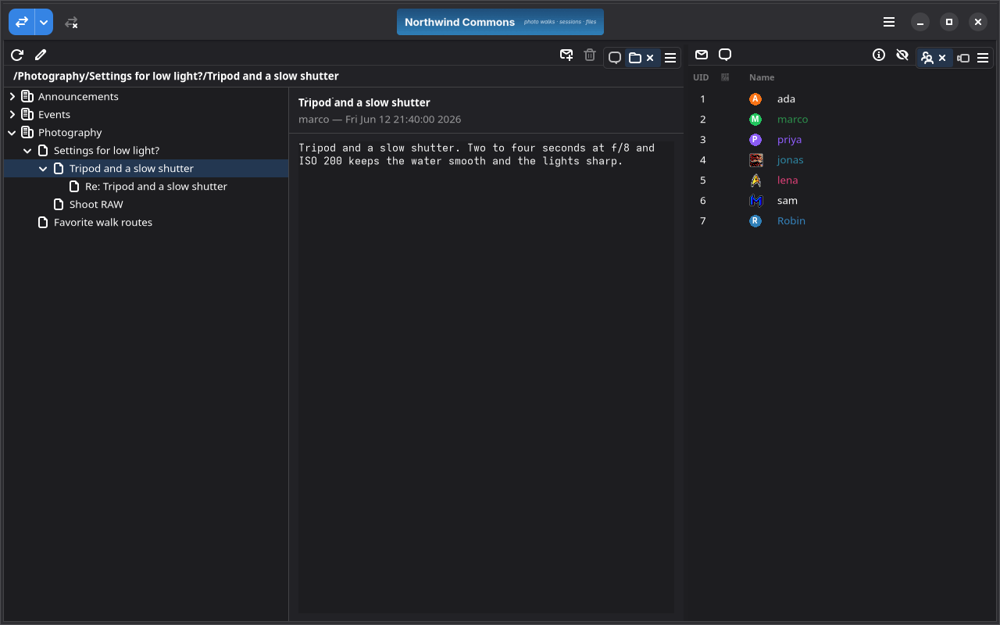
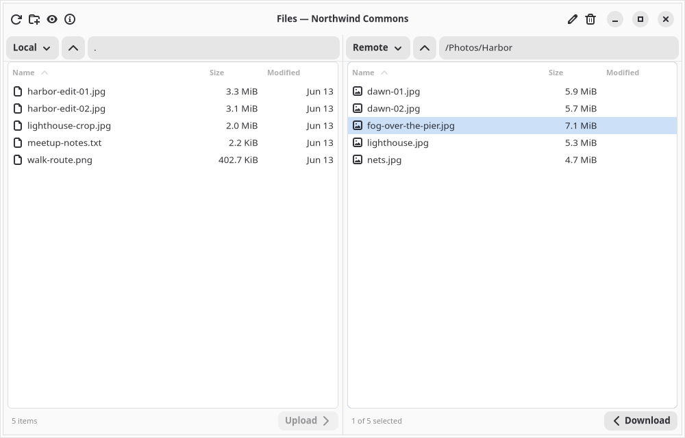
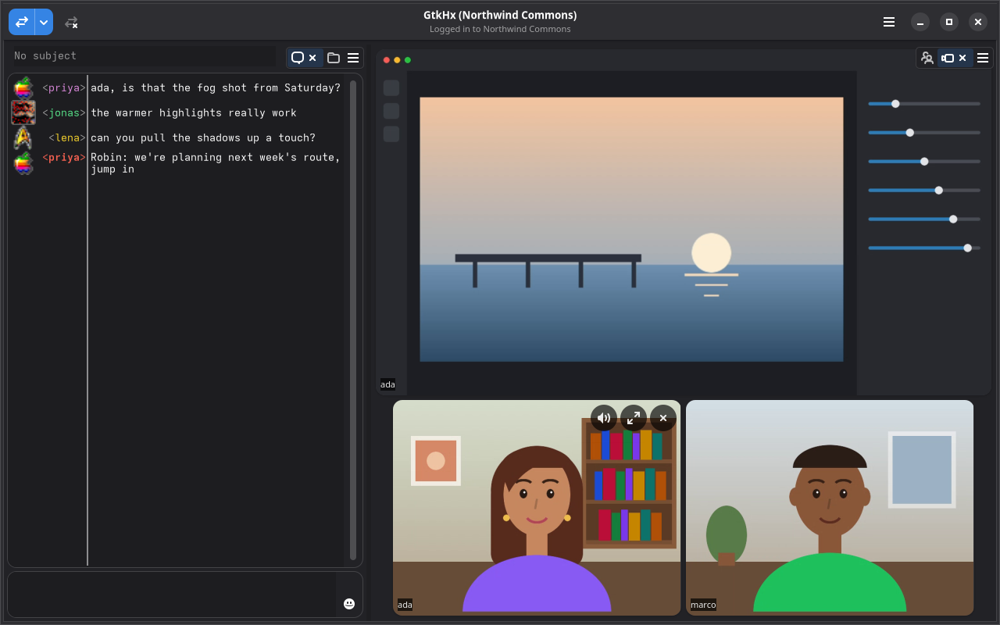
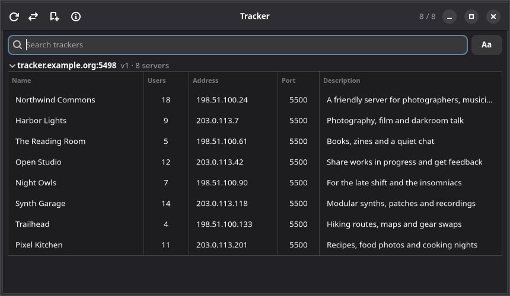
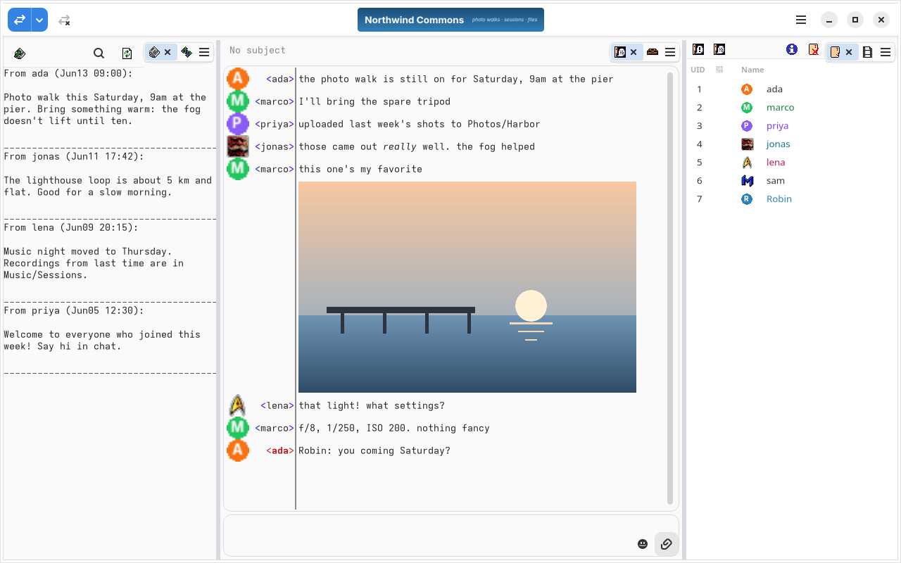

GtkHx is a client for Hotline, the chat and file-sharing system from 1996.
A Hotline server is a small community of its own: a public chat room,
private messages, a shared file library, and a news board, all run by
whoever hosts it. Trackers list the servers that are up, so you can go
looking for one.

GtkHx was first written in 2000 for GTK+ 1.2. It has since been rebuilt
for GTK 4 and libadwaita, and much of it rewritten in Rust, while staying
fully compatible with the Hotline 1.2, 1.5 and 1.9 servers still running
today.

## Get GtkHx

The current version is **1.5.0**.

- **Linux:** the Flatpak, from GtkHx's own repository. Install it with
  `flatpak install --user https://dl.gtkhx.org/gtkhx.flatpakref`, and it
  updates like any other Flatpak app. `gtkhx-beta.flatpakref` follows the
  betas instead.
- **macOS:** the `.zip` for Apple silicon (`arm64`) or Intel (`x86_64`),
  from the [latest release](https://github.com/mishan/gtkhx/releases/latest).
- **Windows:** the `win64` `.zip`, from the
  [latest release](https://github.com/mishan/gtkhx/releases/latest).

Or [build it yourself](https://github.com/mishan/gtkhx#building). What's
new in each version is in the
[changelog](https://github.com/mishan/gtkhx/blob/main/CHANGELOG.md).

## Screenshots

*Threaded news*

*Browsing a server's files*

*Video chat and screen sharing*

*Finding servers on a tracker*

*The Classic theme, with the original pixel-art icons*

## Finding a server

GtkHx comes with a few servers in Settings → Connections to get you
started. For more, open the tracker (Ctrl+T): it lists the servers that
are online now, and you can search them by name.

## Features

- **Chat** with formatted text, colored names, inline images, emoji
  shortcodes, and a searchable history
- **Private messages** and private chat rooms
- **Files:** a two-panel browser for downloading and uploading, with
  previews of images, PDFs, source code and classic Mac PICT files
- **News:** both the original flat news and threaded news with
  categories and replies
- **Voice chat, video chat and screen sharing**, on servers that support
  them
- **Several servers at once**, each in its own tab
- **Secure connections** over TLS, with fingerprint pinning, and
  encrypted logins with Blowfish or ChaCha20-Poly1305
- **Your layout:** dock panels side by side, drag their tabs between
  panes, or pull them out into windows of their own, the way the original
  Hotline client worked
- **Themes**, light and dark, including a Classic theme with the
  original pixel-art icons
- **Notifications** and a tray icon
- **Update notices** in the Flatpak, which can update and restart itself
- Runs on **Linux, macOS and Windows**

GtkHx also speaks the
[modern extensions](https://github.com/fogWraith/Hotline/tree/main/Docs/Protocol)
some servers offer: native UTF-8, large file transfers, chat history, GIF
icons, and tracker v3 with search.

GtkHx works with any Hotline 1.2, 1.5 or 1.9 server. It is tested against
[mhxd](https://github.com/kangsterizer/mhxd), Janus,
[hxd-ng](https://github.com/mishan/hxd-ng), hlservd (the Hotline 1.9
server) and the Argus tracker.

## History

GtkHx began in 2000 as a GTK+ front end to hx, the terminal client Ryan
Nielsen and David Raufeisen wrote alongside hxd, the open-source
[Hotline](https://en.wikipedia.org/wiki/Hotline_Communications) server.
Over the next three years it grew into a client of its own, with threaded
news, resumable file transfers and HOPE secure logins. Version 0.9.4, in
May 2003, was the last release for more than twenty years.

In 2026, Misha Nasledov picked it back up. The Hotline servers were still
running, and the people on them were still talking, but there was nothing
modern on Linux to connect with. GtkHx was carried forward through GTK 2
and 3 to GTK 4 and libadwaita, released as 1.0, and has been rewritten in
Rust piece by piece ever since. Along the way it picked up what the
community added to Hotline in the meantime, from TLS and chat history to
voice and video, without ever breaking the old servers it was written for.

### Thanks

GtkHx had help the first time around, and its About window still says so:

- **Ryan Nielsen** and **David Raufeisen**, whose hx client it grew out of
- **Aaron Lehmann**, who helped fix a few things
- **Jean-Sebastien Hubert**, who contributed translations
- **Philip Neustrom**, who wrote a guide to using the original version
- **Jonathan C. Sitte**, who made the original GtkHx website on SourceForge
- **apocalypse**, a collaborator on the original

## Community

The [Hotline Wiki](https://hlwiki.com) keeps the history of Hotline and
the clients, servers and trackers still around today, and it's the best
place to start looking for somewhere to connect. Its
[Discord](https://discord.gg/vdxJHwzfrN) is where much of the community
talks now, Misha included, and a good place to ask about GtkHx.

## License

GtkHx is free software, under the GNU General Public License, version 2
or (at your option) any later version. The source is on
[GitHub](https://github.com/mishan/gtkhx).
